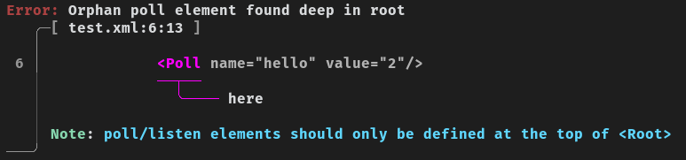

# Errors

Errors are one of the main reasons why you should use **XmlMan**. It uses the [ariadne crate](https://github.com/zesterer/ariadne/) to output pretty errors that everyone can understand.

**Here is an example error:**

